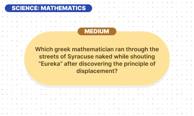
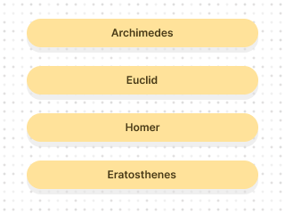

# Quizzler 3Ds

This is my first 3Ds homebrew game. The questions are sourced from [Open Trivia DB](https://opentdb.com/) created by PIXELTAIL Games LLC (License: [CC BY-SA 4.0](https://creativecommons.org/licenses/by-sa/4.0/)).

Special thanks to all of the developers who have contributed to [devkitPro](https://devkitpro.org/) and the examples found in [3ds-examples](https://github.com/devkitPro/3ds-examples).
